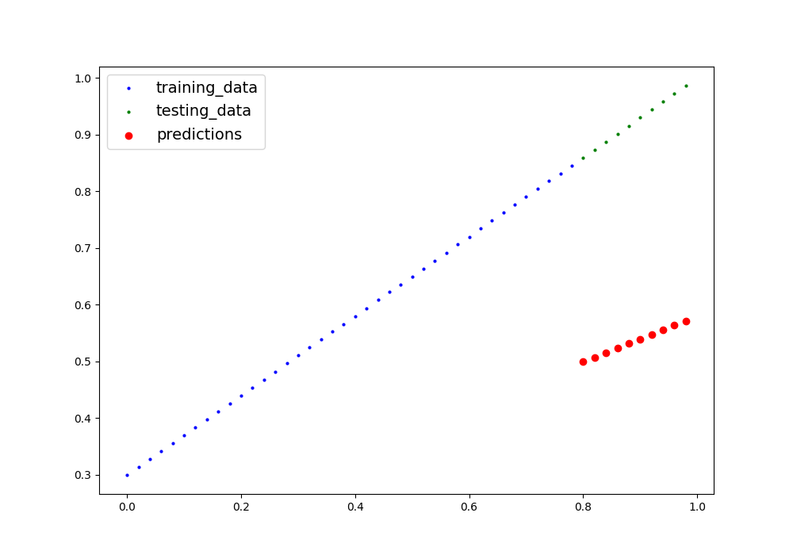

# ML- Basic Linear Regression model - From Scratch using Python3.

## Learning objectives

- How a basic linear regression model works.


## Description

In this repository, I show how to implement a very basic linear regression model using Python. I intentionally didn't use OOP programming because there is no need for this simple task, but anyone could give it a try as an extra exercise.


This is how the model learns through the training phase:

At the beginning, the weights and bias (parameters) are initialized to random values. (Actually, there is a lot to say about how to correctly initialize the weights at the beginning but let's make it simple for this task.)




### Task requirements

- This task does not require any library requirements except numpy and matplotlib.

so be sure to have numpy and matplotlib on your system otherwise run this on your terminal:

```
    pip install numpy matplotlib
```


### Author

👤 **Alex Eponon**
​
- GitHub: [@Anvi98](https://github.com/Anvi98)

- Twitter: [@anvi_al](https://twitter.com/anvi_al)

- LinkedIn: [Alex Eponon](https://www.linkedin.com/in/anvi-alex-eponon/)

